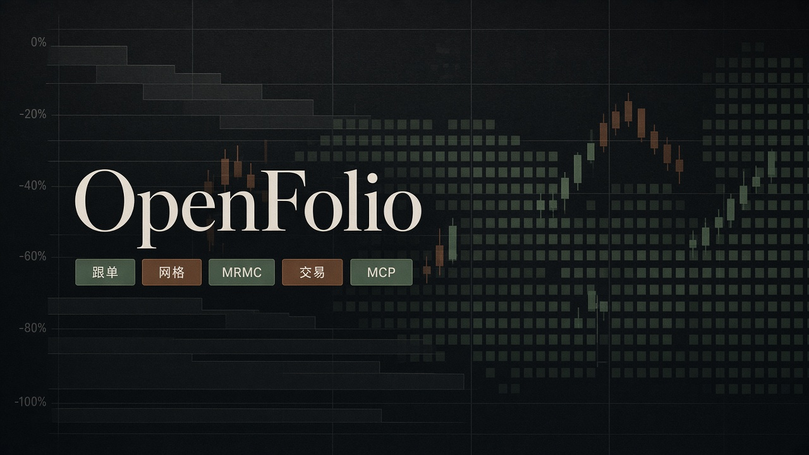

<picture>
  <source media="(prefers-color-scheme: dark)" srcset="https://raw.githubusercontent.com/cody1991/cody1991/output/github-contribution-grid-snake-dark.svg">
  
</picture>

<picture>
  <source media="(prefers-color-scheme: dark)" srcset="https://raw.githubusercontent.com/cody1991/cody1991/output/bomberman-contribution-graph-dark.svg">
  <source media="(prefers-color-scheme: light)" srcset="https://raw.githubusercontent.com/cody1991/cody1991/output/bomberman-contribution-graph.svg">
  
</picture>

---

## OpenFolio

最近的重点项目。

美股投资辅助，已上线：[codytang.cn](https://codytang.cn)。目前小范围在用，暂不对外开放。

1. **组合跟单** — 盯公开组合调仓，按仓位映射到长桥 / 富途 / IBKR
2. **百分比网格** — 回撤买、反弹卖；贪恐过冷过热会自动启停格子
3. **MRMC** — 扫 MACD 背离，提示可能的抄底和卖出
4. **只读 MCP** — [openfolio-ro-mcp](https://github.com/cody1991/openfolio-ro-mcp) 给 AI 助手看持仓、网格和信号，不能下单